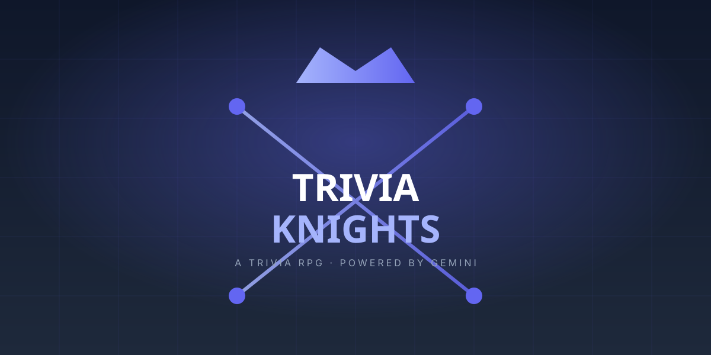

# ⚔️ Trivia Knights

> A turn-based RPG where you defeat enemies by answering trivia questions generated on the fly by Google's **Gemini 2.5 Flash-Lite**. The harder the question, the more damage you deal.

Built for **Hizaki Labs** with a strict zero-cost stack: Next.js 14 (App Router) hosted on Vercel, Tailwind CSS for the design system, and a single serverless API route for the AI integration.

---

## ✨ Features

- 🧠 **Infinite dynamic questions** powered by Gemini 2.5 Flash-Lite.
- 👹 **Enemy-themed categories** — a *Math Goblin* asks math, a *History Knight* asks history, etc.
- 📈 **Scaling difficulty** that ramps up the deeper you go.
- 💥 **Damage system** — every correct answer slices the enemy; every wrong one hits *you*.
- 🎨 **Hizaki Labs visual identity** — Indigo `#6366f1`, dark accents `#0f172a` / `#1e293b`, Inter + Space Grotesk, rounded corners, hover scales, smooth animations.
- 🔒 **Secure by design** — the API key is *only* on the server, never shipped to the browser.
- 💸 **Zero cost** — runs on Vercel's free tier + Gemini's free tier.

---

## 🎮 How to Play

1. Click **Start Adventure** on the title screen.
2. An enemy appears (e.g. *Goblin of Arithmetic*).
3. A trivia question loads — answer before the timer runs out.
4. Correct → deal damage equal to the question's difficulty score.
5. Wrong / timeout → the enemy strikes you.
6. Survive 10 encounters to become the **Trivia Knight**.

---

## 🧱 Tech Stack

| Layer        | Tool                                  |
| ------------ | ------------------------------------- |
| Frontend     | Next.js 14, React 18, Tailwind CSS    |
| Backend      | Vercel Serverless Functions (`/api`)  |
| AI           | Google Gemini 2.5 Flash-Lite          |
| Hosting      | Vercel (Free Hobby tier)              |
| Fonts        | Inter (body) + Space Grotesk (head)   |

---

## 🚀 Quick Start

\`\`\`bash
# 1. Install
npm install

# 2. Add your Gemini API key
cp .env.example .env.local
# then edit .env.local and paste your real key

# 3. Run
npm run dev
# open http://localhost:3000
\`\`\`

---

## 🔐 Environment Variables

| Name             | Where                  | Required | Notes                                          |
| ---------------- | ---------------------- | -------- | ---------------------------------------------- |
| `GEMINI_API_KEY` | Local `.env.local` + Vercel Dashboard | Yes | Get one free at [aistudio.google.com](https://aistudio.google.com/app/apikey) |

---

## 🗂️ Project Structure

\`\`\`
trivia-knights/
├── app/
│   ├── api/
│   │   └── generate-question/
│   │       └── route.ts        # Gemini 2.5 Flash-Lite serverless function
│   ├── game/
│   │   └── page.tsx            # Game screen
│   ├── globals.css             # Tailwind + custom styles
│   ├── layout.tsx              # Root layout (fonts, metadata)
│   └── page.tsx                # Landing/title screen
├── components/
│   ├── BattleArena.tsx         # Core combat UI
│   ├── EnemyCard.tsx           # Animated enemy display
│   ├── QuestionPanel.tsx       # Question + 4 answer buttons
│   ├── HealthBar.tsx           # Animated HP bar
│   ├── DamageNumber.tsx        # Floating damage popup
│   └── StartScreen.tsx         # Title + "Start Adventure"
├── lib/
│   ├── enemies.ts              # Enemy definitions + categories
│   ├── gameState.ts            # React state machine for combat
│   └── types.ts                # Shared TypeScript types
├── public/
│   ├── icon.svg / icon.ico
│   ├── favicon.svg / favicon.ico
│   └── banner.svg
├── .env.example
├── .gitignore
├── next.config.js
├── package.json
├── postcss.config.js
├── tailwind.config.js
├── tsconfig.json
└── vercel.json
\`\`\`

---

## 📜 License

MIT © Ajxrhaider — see [LICENSE](./LICENSE).

---

## 🙏 Credits

- Designed & engineered for **Hizaki Labs** ([hizakilabs.com](https://hizakilabs.com)).
- Trivia content generated by [Google Gemini](https://deepmind.google/technologies/gemini/).
- Icons hand-rolled in SVG.